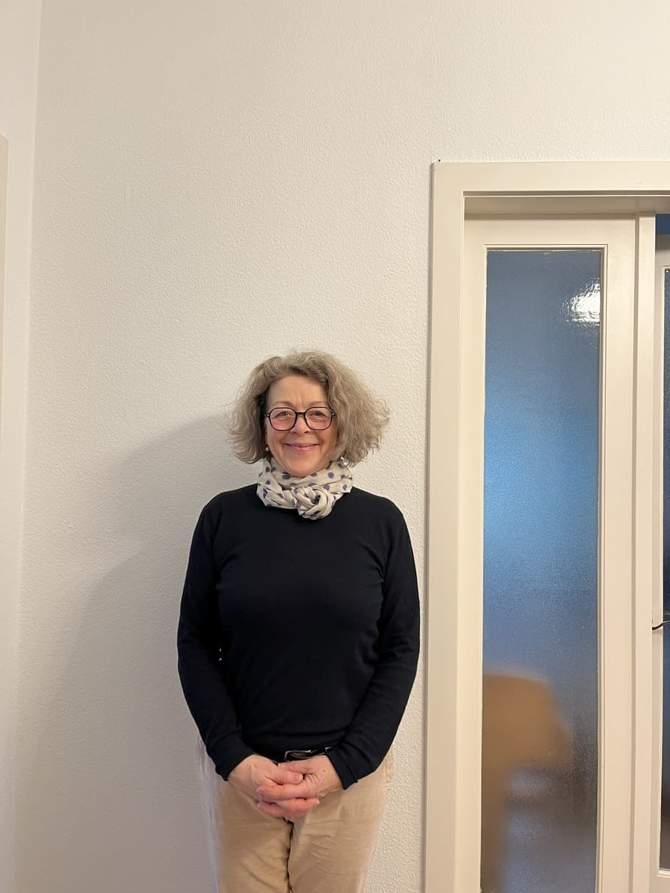

+++
title = "Wie eine Zugfahrt ein Leben und eine Identität veränderte"
date = "2025-02-28"
draft = false
pinned = false
tags = ["#interview#identität#langeBeziehung"]
image = "img_3575-kopie-2.jpeg"
+++


#### Eine lange und glückliche Beziehung führt Eva Eigner mit Ihrem Mann Malcolm. In diesem Interview erzählt sie, wie die Partnerschaft ihre Identität beeinflusst hat.

 

**Wann und wo hast du Malcolm kennengelernt?**

Ich habe Malcolm auf einer Reise kennengelernt, im Zug von China zurück nach Europa. Es war exakt am 7 September 1988. Das konnten wir auf dem Zugticket nachschauen.

**Und wie lange seid ihr schon zusammen?**

Seit 1988, also 36 Jahre.

 Eva Eigner wurde 1960 in München, Bayern geboren. Dort wohnte und arbeitete sie als Fachlehrerin in Textil und Werken bis 1995.1997 zog sie in die Schweiz, da ihr Mann Malcolm in der Schweiz eine Arbeit angenommen hatte. Mit ihm ist sie schon sehr lange glücklich verheiratet. 

**Wie würdest du dich beschreiben, bevor du mit Malcolm zusammenkamst? Was waren deine typischen Eigenschaften?**

Ein riesengrosser Unterschied war, dass ich in Deutschland gearbeitet habe und mein eigenes Gehalt hatte. Ich hatte mein Bankkonto, meine Versicherungen und konnte alles machen. Ich war eine berufstätige und vollkommen unabhängige Frau.

**Wie würdest du dich jetzt beschreiben? Was sind deine typischen Eigenschaften?**

Ich glaube sehr, dass man nicht aufgeben darf und weitersuchen muss, um das wieder zu finden, was man einmal hatte oder gern mochte. Ich habe mich bei sehr vielen Schulen gemeldet, bekam aber in all den Jahren nur eine einzige Vertretung. Jedoch hatte ich nach ungefähr drei Jahren Glück, da man in einer englischen Schule Verstärkung gesucht hatte. So konnte ich wieder unterrichten. Ich konnte mich über die Jahre wieder zu der Person zurück entwickeln, die ich einmal war. Da ich mittlerweile auch schon länger hier lebe, konnte ich mehr Sozialkontakte knüpfen, was sicher auch ein wichtiger Schritt war, damit ich mich wohler gefühlt habe. Die Veränderung in meiner Heimat habe ich durch kurze Besuche nur bedingt mitbekommen. Das hat dazu beigetragen, dass ich meine Identität eher bewahrt habe, eben weil ich ins Ausland gegangen bin. Ich finde, ich bin so, wie ich einmal war.

**Ihr habt euch dann ein Leben in der Schweiz aufgebaut. Wie kam es dazu?** 

Ein Leben hatte ich schon in Deutschland. Ich war verbeamtet und habe das Geld verdient, während Malcolm noch studierte. Später habe ich mit unseren beiden Kindern dort gelebt, während wir über sieben Jahre eine typische Ausländer Fernbeziehung geführt haben. In die Schweiz sind wir dann endgültig 1997 gezogen, da Malcolm 1995 hier eine Arbeit angenommen hatte.

**Wie hat es dich und deine Identität verändert, dass du wegen Malcolm in die Schweiz gekommen bist?**

Die Veränderung habe ich nicht so wahrgenommen, da ich so sehr damit beschäftigt war, hier Fuss zu fassen und ein Leben aufzubauen sowie die Kinder in die Schule zu bringen. Austausch hatte ich keinen, nur am Abend oder am Telefon. Ich wurde von einer berufstätigen und unabhängigen Frau zur Hausfrau degradiert. Von aussen wurde sicher viel mehr erkannt, wie unglücklich ich war. Erst später habe ich erkannt, dass es gut war, dass ich bei den Kindern zuhause sein konnte. Dadurch war es jedoch trotzdem schwierig, Sozialkontakte zu haben. Erst als ich durch eine Bekannte einige Prüfungsaufsichten übernehmen durfte, konnte ich hinausgehen und neue Menschen kennenlernen. Wieder in die Schule zu gehen, war für mich das Höchste. Meine Identitäten, die ich dadurch hatte, hätten nicht verschiedener sein können, genau wie Tag und Nacht. 

 **In seiner Bildnistheorie beschreibt Max Frisch das liebende und lieblose Verhalten. Inwiefern trifft das auf euch zu?** 

Ich glaube, dass wir uns gegenseitig immer wieder aus der Schublade herausnehmen können, sonst hätten wir ja gar nichts mehr miteinander zu Reden. Ich habe schon meine Vorstellung wie er ist, bin aber offen diese täglich zu revidieren und Möglichkeiten zu sehen, etwas an dem Bild zu ändern. Persönlich finde ich es wichtig, die Schublade immer wieder zu öffnen und zu schauen ob vielleicht noch etwas anderes drin ist, von dem ich keine Ahnung habe.

**Also trifft bei euch Beides zu?**

 Ja schon. Ich habe eine gewisse Vorstellung von ihm. Ich finde, wenn man seinen Partner in der Schublade lässt, passiert weiter nichts mehr oder man denkt, es hat ja eh keinen Sinn. Aber dann ist man gar nicht so lange zusammen. Malcolm und ich sind schon 36 Jahre zusammen und ich möchte gerne auch die nächsten 36 Jahre mit ihm verbringen und noch viele neue Dinge über ihn herausfinden. Ich glaube ein Mensch ändert sich, wenn er älter wird, wenn es immer wieder neue Dinge in seinem Leben gibt und man dadurch neue Dinge an dieser Person entdeckt und sieht, dass die Person auch ganz anders sein kann, als man sich das vorgestellt hat.